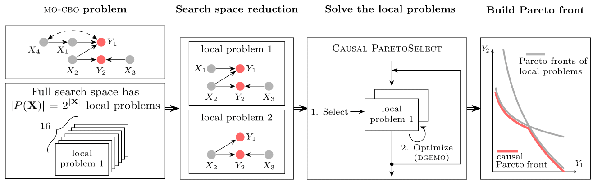
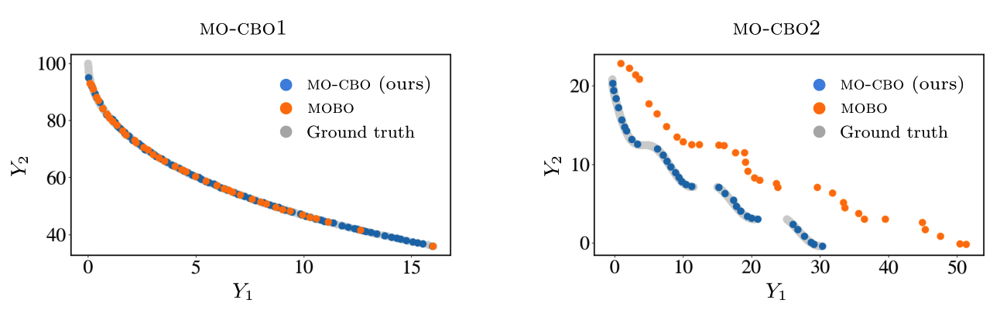
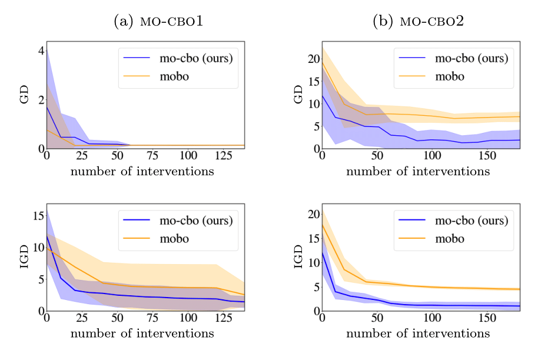

# Multi-Objective Causal Bayesian Optimisation (MO-CBO)
This repository constitutes the Master's thesis of [Shriya Bhatija](www.linkedin.com/in/shriya-bhatija-565699155), which was conducted under joint supervision at the University of Cambridge and the Technical University of Munich (TUM).

[[Thesis]](assets/THESIS.pdf)

Supervisor: [Matthias Althoff](https://www.ce.cit.tum.de/cps/members/prof-dr-ing-matthias-althoff/)

Advisors: [Jakob Thumm](https://jakob-thumm.com), [Paul-David Zuercher](https://pauldavidzuercher.com), [Thomas Bohné](https://www.ifm.eng.cam.ac.uk/people/tmb35/)

#### Abstract
We propose multi-objective causal Bayesian optimisation (MO-CBO), a new problem class for identifying Pareto-optimal interventions that simultaneously optimise multiple target variables within a known causal graph. MO-CBO extends the [causal Bayesian optimisation (CBO)](https://proceedings.mlr.press/v108/aglietti20a/aglietti20a.pdf) family of methods to support optimisation on causal models with multiple outcomes. We prove that any mo-cbo problem can be decomposed into a series of traditional multi-objective optimisa-tion tasks, and introduce Causal ParetoSelect, an algorithm that sequentially balances exploration across these tasks using relative hypervolume improvement. Our methodology generalises multi-objective Bayesian optimisation to perform causally-informed function eval-uations, instead of neglecting known causal relationships. By establishing graphical criteria, we enforce Causal ParetoSelect to explore only potentially optimal sets of variables to intervene upon. We validate our approach on both synthetic and real-world causal graphs, demonstrating its superiority over traditional multi-objective Bayesian optimisation.

#### Methodology Overview


## Code structure
````
external/ --- lhs funtion for sampling
helpers/ --- helper functions
mobo/
 ├── solver/ --- multi-objective solvers
 ├── surrogate_model/ --- surrogate models
 ├── acquisition.py --- acquisition functions
 ├── algorithms.py --- high-level algorithm specifications
 ├── factory.py --- factory for importing different algorithm components
 ├── mobo.py --- main pipeline of multi-objective bayesian optimziation
 ├── selection.py --- selection methods for new samples
 ├── surrogate_problem.py --- multi-objective surrogate problem
 ├── transformation.py --- normalizations on data
 └── utils.py --- utility functions
problems/
 ├── graphs/ --- mo-cbo problems
 ├── common.py --- common functions
 └── problems.py --- Problem class
visualization/ --- performance visualization
create_datasets.py --- dataset creation for the mo-cbo problems
C_ParetoSelect.py --- mo-cbo algorithm 
main.py --- main execution file for the mo-cbo algorithm
````

## Requirements
Python version: tested in Python 3.7.7

Operating system: tested in macOS Sonoma 14.4.1

Install the environment using [miniconda](https://docs.anaconda.com/miniconda/) and activate it:
````
conda env create -f environment.yml
conda activate mo-cbo
````

## Getting started

Run the main file with some specified arguments, e.g. problem name, exploration set, batch size and seed:
````
python main.py --problem mo-cbo1 --exp-set mobo --batch-size 5 --seed 0
````
For more arguments, we refer to *arguments.py*. The results of this experiment will be stored in ```` result/mo-cbo1/int_data/mobo/0/````.
For demonstration purposes, we also run this experiment for the problem mo-cbo2, repeating it for both exploration sets named *mobo* (baseline) and *mo-cbo* (ours). Note that mo-cbo1 and mo-cbo2 are synthetic structural causal models that were specifically designed for this new type of problem class. We visualise the results by running:
````
python visualize/visualize_pf_all.py --problem mo-cbo1 --seed 0
````
The resulting Pareto front visualisations are:



We repeat these experiments across 10 random seeds to report averaged performance metrices that can be visualised by running:
````
python visualize/plots_gd_cost.py --problem mo-cbo1 --metric gd
python visualize/plots_gd_cost.py --problem mo-cbo1 --metric igd
````
The resulting visualisations are:



## Custom Problem Setup 

If you are interested in implementing your own custom problem, please do the following steps:

1. Create the file `problems/graphs/myproblem.py` where the structural causal model will be defined. The function

````
from collections import OrderedDict
import autograd.numpy as anp
from .graph import GraphStructure

class CUSTOM_PROBLEM(GraphStructure):
    def define_SEM(self):
        def fx1(epsilon, **kwargs):
          return epsilon[0]
        def fx2(epsilon, X1, **kwargs):
          return X1 + epsilon[1]
        def fy1(epsilon, X2, **kwargs):
          return X2 + epsilon[2]
        def fy2(epsilon, X2, **kwargs):
          return X2 - epsilon[3]

        graph = OrderedDict ([
          ('X1', fx1),
          ('X2', fx2),
          ('Y1', fy1),
          ('Y2', fy2),
        ])
        return graph
    
    def get_targets(self):
        return ['Y1', 'Y2'] 
    
    def get_exploration_sets(self):
      exploration_sets = {'mo-cbo': [['X2']],'mobo': [['X1', 'X2']]}
      return exploration_sets

    def get_set_MOBO(self):
      return ['X1', 'X2']
    
    def get_interventional_ranges(self):
      dict_ranges = OrderedDict ([
          ('X1', [-1, 1]),
          ('X2', [2, 4]) ])
      return dict_ranges  
    
    def get_cost_structure(self, type_cost):
        costs = OrderedDict ([('X1', 1),('X2', 1),])
        return costs
````

2. In `problems/__init__.py`, add your custom problem as `.graphs.myproblem import CUSTOM_PROBLEM`
3. In `problems/common.py`, add an abbreviation of your custom problem to the function `get_cbo_options()`, e.g. `custom: CUSTOM_PROBLEM()`
4. Create the observational and interventional datasets that will be used by the algorithm. For this run
  ````
  create_datasets.py --problem custom --exp-set mobo --seed 0
  ````
   

## Citation
Master's thesis jointly conducted at the Technical University of Munich and University of Cambridge. If you find our repository helpful for your work, please cite our paper:
TBA 
